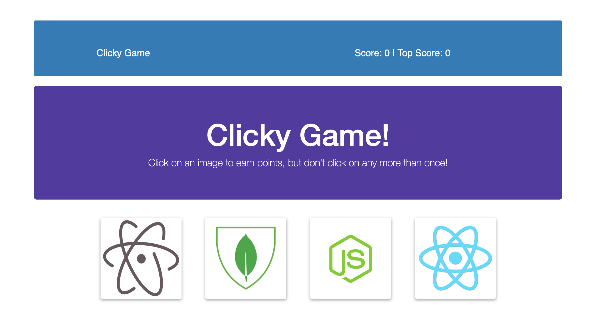

# React - Clicky Game

## Overview

##### Project Link: (https://derekgeorg.github.io/clickygame/)

The Clicky Game is a simple memory game created with React.

When the app loads, four separate images are shown and the Score is set to 0.

Click an image and the images shuffle randomly. 

If you go through all of the images without selecting any of them twice, you win! And your score goes up by one. 

You can keep playing until you select the same image twice. At that time, an alert notifies you that you've lost and the game resets, but saves your Top Score.

### Learned:
* Breaking up application's UI into components
* Manage component state
* Respond to user events
* Shuffling images randomly

